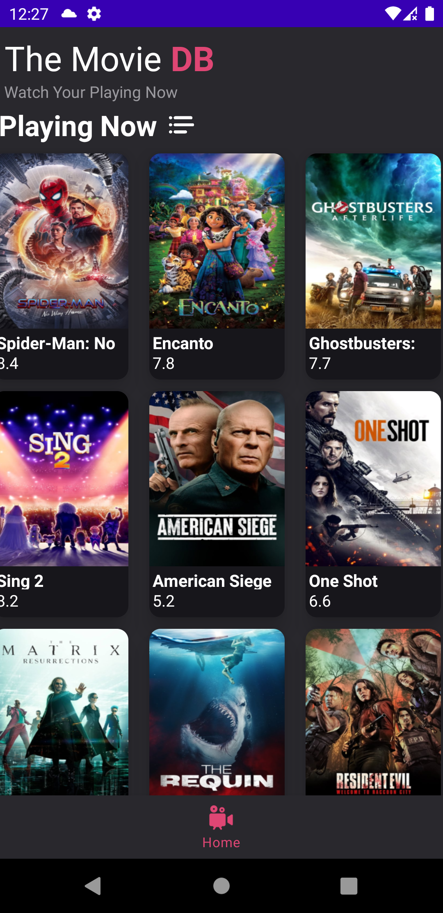

# The-Movies-DB
The-Movies-DB

El punto que me falto terminar fue la persistencia de datos, no opte por agregar ROOM o SQLITE
ya que para este caso quería analizar un poco mas el desarrollo así que me encontré una librería
llamada CoroutinesCache, la cual me pareció muy interesante, ya que me permite tener persistencia
de datos, la cual se puede configurar para establecer el tiempo de LifeTime de la persistencia de datos
al igual se puede configurar el tamaño del cache que se almacenara..

Cada aplicación de Android es una aplicación de cliente, lo que significa que no tiene sentido crear y mantener una base de datos solo para almacenar datos en caché.

Agregue las clases y librerías correspondientes, de la librería antes mencionada falto implementar la logica de dicha librería.

https://github.com/epam/CoroutinesCache

